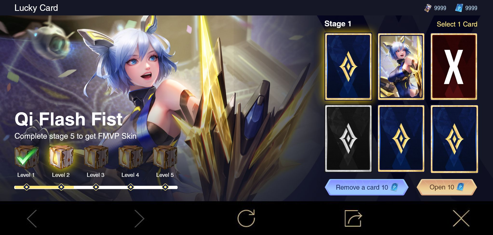

# AOV Lucky Card (Frontend Intern Garena)

## Deskripsi
Make event for AOV Event. The user will try to guess where the card with the character in it is and if it is correct it will continue to the next stage until 5 stages and where the higher the stage, the card containing the wrong card will continue to increase.

## Screenshot

 \
 \
 \
 \

## Tech Stack

#### Frontend

1. [ReactJS](https://reactjs.org/) (Javascript Framework)
2. [SASS](https://sass-lang.com/) (CSS Framework)
3. [Axios](https://www.npmjs.com/package/axios) (Data Fetching)
4. [Redux](https://redux.js.org/) (State Management)

## Repository

1. [Secret](#)

## Contributors

1. [Muhammad Alfi Syahri Nasution](https://github.com/alfi2811)

## Note

The event is already end in the AOV game.
