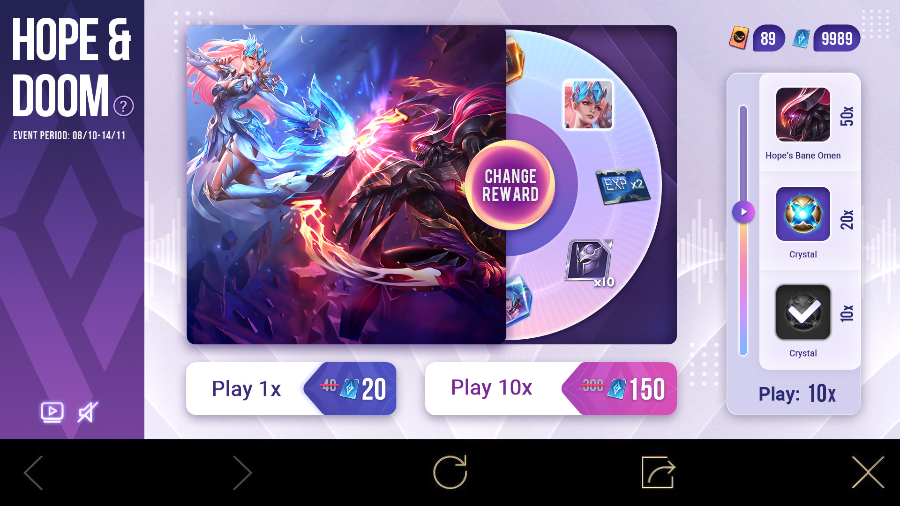
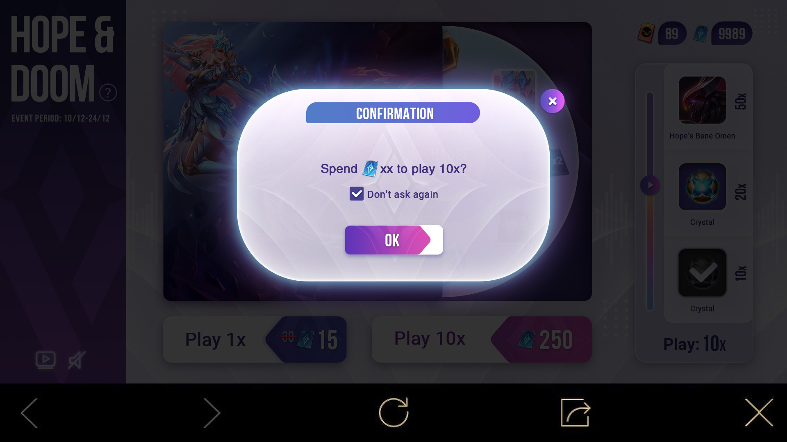
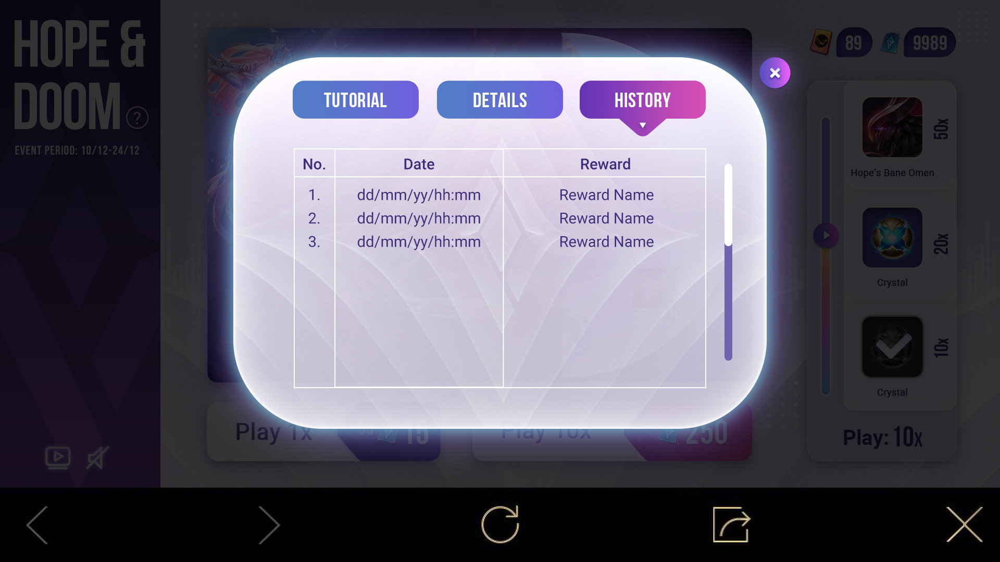
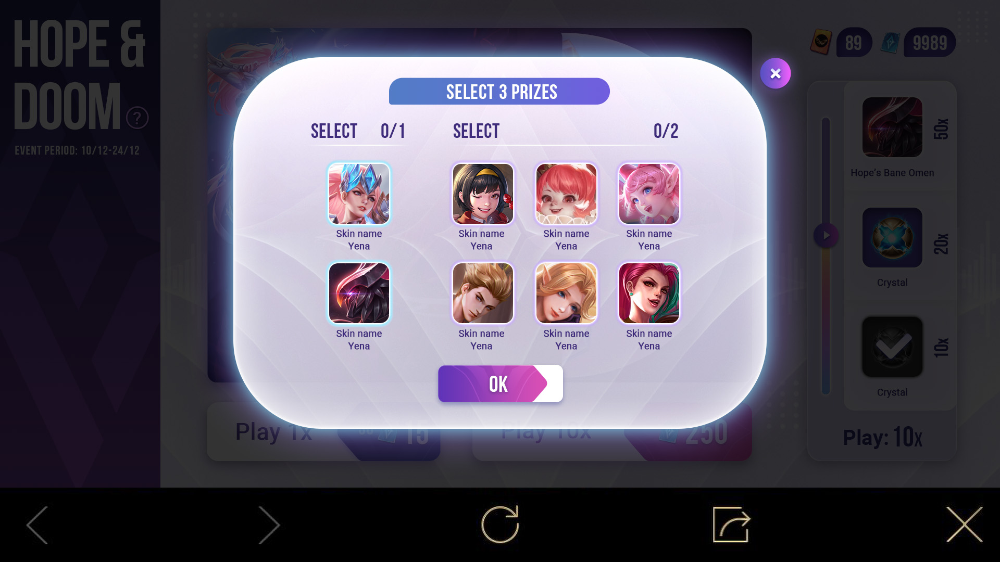
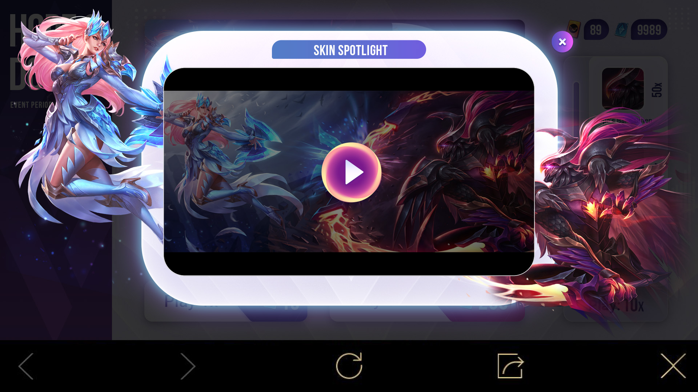

# AOV Ramadhan (Frontend Intern Garena)

## Deskripsi
Make event for player AOV. Player will play and the disc will spin and stop with a prize that player get and if player have played for several times, then player will get the prize that was previously selected

## Screenshot

 \
 \
 \
 \

## Tech Stack

#### Frontend

1. [ReactJS](https://reactjs.org/) (Javascript Framework)
2. [SASS](https://sass-lang.com/) (CSS Framework)
3. [Axios](https://www.npmjs.com/package/axios) (Data Fetching)
4. [Redux](https://redux.js.org/) (State Management)

## Repository

1. [Secret](#)

## Contributors

1. [Muhammad Alfi Syahri Nasution](https://github.com/alfi2811)

## Note

The event is already end in the AOV game.
