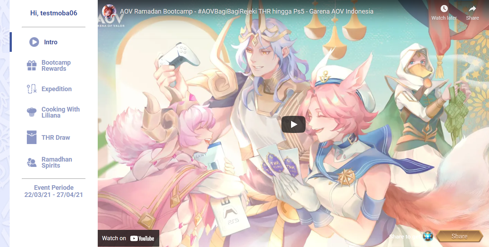
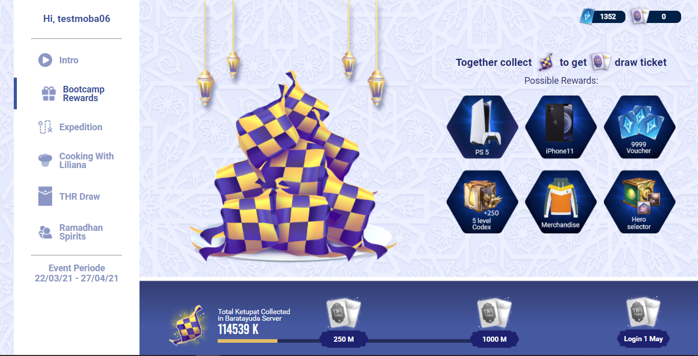
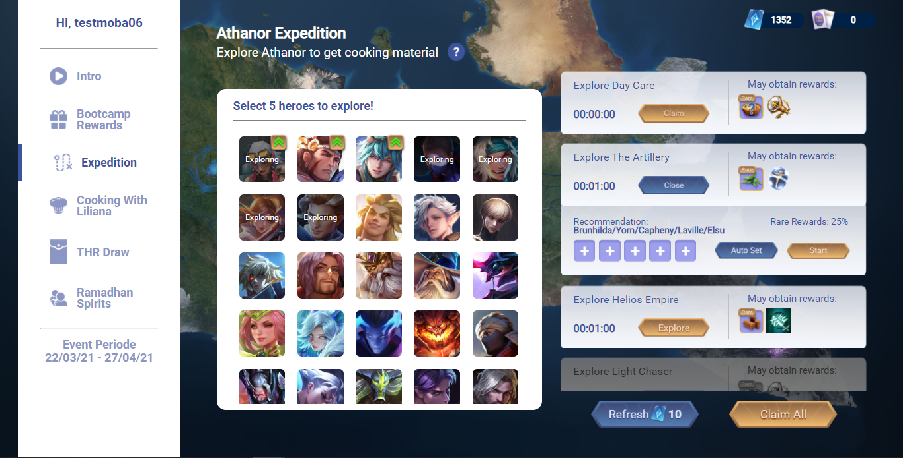
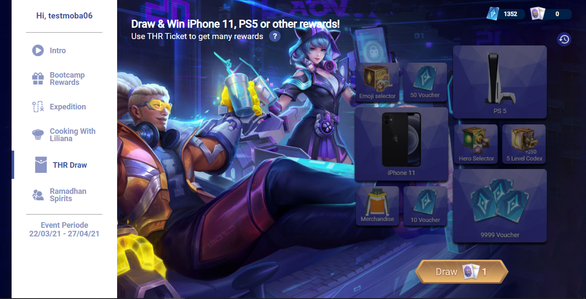
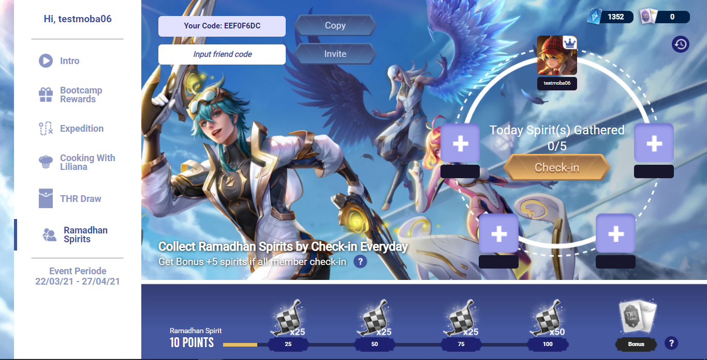

# AOV Ramadhan (Frontend Intern Garena)

## Deskripsi
Make event for one month of ramadhan. Users can search material for making kolak with the expedition feature and can draw if they get thr tokens from making kolak and can also invite friends to complete missions together.

## Screenshot

 \
 \
 \
 \
 \

## Tech Stack

#### Frontend

1. [ReactJS](https://reactjs.org/) (Javascript Framework)
2. [SASS](https://sass-lang.com/) (CSS Framework)
3. [Axios](https://www.npmjs.com/package/axios) (Data Fetching)
4. [Redux](https://redux.js.org/) (State Management)

## Repository

1. [Secret](#)

## Contributors

1. [Muhammad Alfi Syahri Nasution](https://github.com/alfi2811)

## Live Demo

The event is still in the AOV game.
