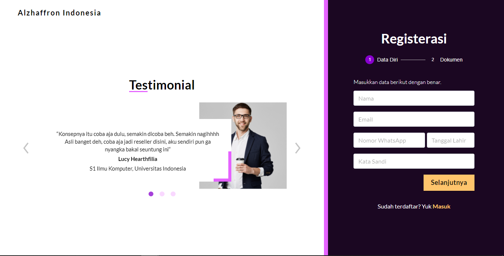

# Alzhaffron Website (On Progress)

## Deskripsi
Make e-commerce website for Saffron Seller. In this project, My task as Frontend to create a website display and connect it to API using ReactJS and Redux.

## Screenshot

## Tech Stack

#### Frontend

1. [ReactJS](https://reactjs.org/) (Javascript Framework)
2. [Material UI](https://material-ui.com/) (CSS Framework)
3. [Axios](https://www.npmjs.com/package/axios) (Data Fetching)
4. [Redux](https://redux.js.org/) (State Management)

## Repository

1. [Frontend](https://github.com/alfi2811/alzhaffron-website)

## Contributors

1. [Muhammad Alfi Syahri Nasution](https://github.com/alfi2811)

## Live Demo

[alzhaffron.netlify.app](https://alzhaffron.netlify.app/)