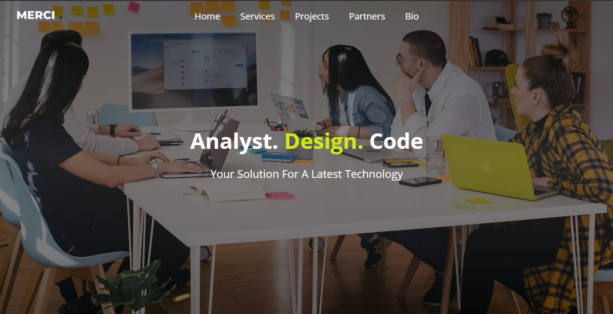

# Company Profile

## Deskripsi
A final exam of learn basic web programming course from Dicoding. Made it using HTML and CSS.

## Screenshot

.\

## Tech Stack

#### Frontend

1. [HTML](https://www.w3schools.com/html/)
2. [CSS](https://www.w3schools.com/css/)

## Repository

1. [Frontend](https://github.com/alfi2811/exampleCompanyProfile)

## Contributors

1. [Muhammad Alfi Syahri Nasution](https://github.com/alfi2811)

## Live Demo

[Company Profile](https://example-company-profile.netlify.app/)