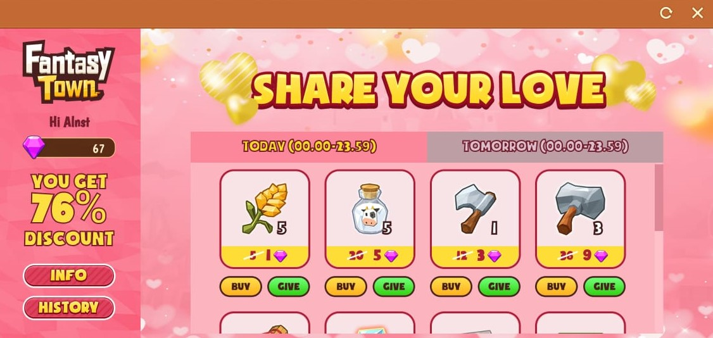

# Fantasy Town Valentine (Frontend Intern Garena)

## Deskripsi
My first project at Garena Indonesia, make Fantasy Town event for celebrating valentine that user can buy item with discount price.

## Screenshot

## Tech Stack

#### Frontend

1. [ReactJS](https://reactjs.org/) (Javascript Framework)
2. [SASS](https://sass-lang.com/) (CSS Framework)
3. [Axios](https://www.npmjs.com/package/axios) (Data Fetching)
4. [Redux](https://redux.js.org/) (State Management)

## Repository

1. [Secret](#)

## Contributors

1. [Muhammad Alfi Syahri Nasution](https://github.com/alfi2811)

## Live Demo

The event already finished.
